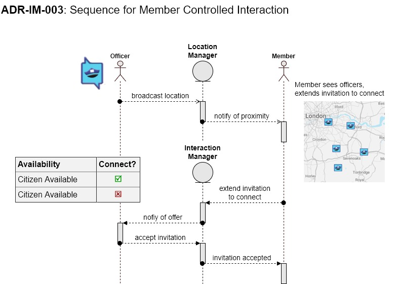
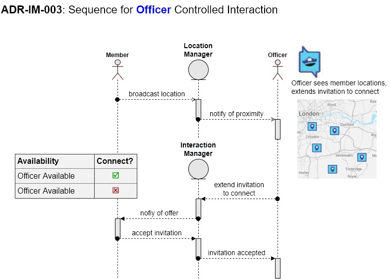

# ADR-IM-003 Provide design option to protect office location
status: Approved  
date: 2022-11-08  
deciders: Shari

## Context and Problem Statement
The interaction management system requires a member of the community and an officer to interact.

As such the profile manager will need to identify the users as a member or an officer.  However the privacy and identification of individuals must be protected.

## Decision Drivers
The design options

### Design option 1 member control
In this option, the officers cannot find the community members, the members control the interaction

### Design option 2 officer control
In this option, the members cannot find the officers, the officers control the interaction

## Decision
The recommendation is design option 2 officer controlled

## Consequences
A critical consequence is a change in requirements.  Officer locations are a requirement, however, pushing back on the requirements is advisable for the protection of the officers and discouraging criminal activities.

