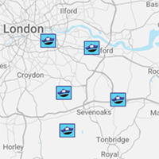
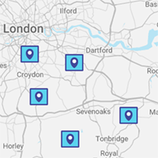
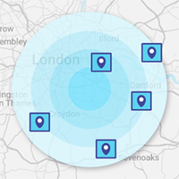

status: accepted
date: 2022-11-08  
deciders: Shari, Miguel, Uma

# ADR-013 Provide radar for local area

## Context and Problem Statement
Any system that tracks the locations of all police officers in an area presents an inherent risk.

Therefore the design of the system adheres to the architectural characteristic of security and is designed to not gather or persist officer locations at all.

This way even if the system undergoes a security breach, sensitive information is simply not available.

## Decision Drivers
There are a number of options for the map display as described below:

 * Show either citizens or officers 
 * Show either a map or a proximity radar

                         

## Decision
The solution to the problem is to define community hubs.  The recommendation is a hybrid approach of radar and map to guide the citizen to the community hub

These community hubs can be parks, shopping centres or even train stations.

The hub will have a QR code displayed and the officer will check in if she or he is in the area and has capacity for community engagement.

The system will notify registered citizens as they approach an open hub.

Citizen's will need to enable location sharing, officers will not.

  1. Officer has capacity for community engagement
  2. Officer scans QR Code that is on the wall of a community hub
  3. System notifies nearby citizens that a hub is open for engagement 
  4. System helps navigate citizens to the community hub

## Consequences
A consequence of the decision is a change to requirements and to not track police officers.

Should the officer tracking be required the recommendation is to isolate the role of a community officer additionally to or over enforcement.

