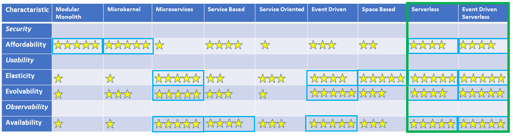

status: accepted  
date: 2022-11-04  
deciders: Kavya, Susmitha, Uma, Miguel, Shari

# Architectural Style of Hey Blue!

## Context and Problem Statement

We must ensure that any Architectural Style selected for the system as a whole, or for constituent parts, has good domain-to-architecture isomorphism and it performs well against the core architectural characteristics against which it will be measured.

## Decision Drivers

The core Architectural Characteristics, along with domain to architecture isomorphism, are decision drivers. However, generally speaking the characteristics marked as orthogonal/non-structural don't directly feed into this decision. All styles can equally be built to support those characteristics. For Hey Blue!, with it's required focus on operational and analytical data feeding evolution there is a strong need to support persisted temporal Events in addition to Logs, Metrics and Traces (this is covered in the Observability ADR linked below). Given this Event-Driven styles may be seen as having an edge. Particularly if Domain Driven Design is used to identify the Events, and the store is an EventStore (as in Event Sourcing). In this case the EventStore may be used for feeding analytics/ML/AI, but it would also enable Auditing and Compensation based Points Accounting in the Rewards, Redemption and Accounting System.

- Domain to Architecture Isomorphism
- [Security](../characteristics/0003-security.md) - orthogonal/non-structural
- [Affordability](../characteristics/0004-affordability.md)
- [Usability](../characteristics/0005-usability.md) - orthogonal/non-structural
- [Elasticity](../characteristics/0006-elasticity.md)
- [Evolvability](../characteristics/0007-evolvability.md)
- [Observability](../characteristics/0008-observability.md) - orthogonal/non-structural
- [Availability](../characteristics/0009-availability.md)

## Considered Options

- Modular-Monolith
- Microkernel
- Microservice
- Service Based
- Service-Oriented
- Event Driven
- Space Based
- Serverless
- Event Driven Serverless

## Decision Outcome

Chosen option: "Event-Driven Serverless", because after analysis across performance against (particularly structural) architectural characteristics it came out just on top. Furthermore there is good domain-to-architecture isomorphism. Finally, when looking at trade-offs (captured in pros/cons) there were no critical cons to discunt it.

### Consequences

- Good, because we are well aligned with domain-to-architecture isomorphism and all core architectural characteristics
- Good, because because the style aligns with emerging technology, which can be a draw for potential staff
- Bad, because if cloud vendor lock-in is a concern
- Bad, because it may be difficult to find staff with the experience to build

## Validation

We built a worksheet based off of the one found at [Developer to Architect Styles Worksheet](https://www.developertoarchitect.com/downloads/architecture-styles-worksheet.pdf). We considered all styles listed there except for Layered (it was least well suited from the list and has poor domain to architecture isomorphism). We added to the list Serverless and also a hybrid Event-Based-Serverless. The results of our analysis with a table constrained to our core characteristics is as follows:

Hey Blue! will be a platform for proximity _event-based_ interactions that happen _occasionally_ with some multiple hours of non activity expected daily and a curve of activity that matches typical daytime activity (i.e. not 24/7, see details in the assumptions of the [volummetrics](../../../Vision%20and%20Context/Volumetric.md). The _event-based_ aspect of the domain maps most well to event-driven styles. The _occasionality_ maps most well to styles that are elastic and can scale to zero.

## Pros and Cons of the Options

While the matrix only captured the core characteristics, we'll discuss secondary ones in the pros/cons below. We only consider the top 4 options from the analysis here. Namely:

- Microservices with 3 categories with 4-5 stars
- Event Driven with 3 categories with 4-5 stars
- Serverless with 4 categories with 4-5 stars
- Event Driven Serverless with categories with 4-5 stars

### Microservices

- Good as it does well for Elasticity, Evolvability and Availability. However it is pertinent to note that all of these are in the bottom half of core characteristics.
- Good for a secondary characteristic of Testability, which feeds into the capability to implement Fitness Functions
- Bad as it performs the worst of the top 4 for Affordability, which is the second most important characteristic.
- Bad, as outside of core characteristics it also does poorly for Simplicity. This can affect cost indirectly as well as the capability to find technical staff to deliver.

### Event Driven

- Good as it also does well for Elasticity, Evolvability and Availability. As with microservices, these are in the bottom half of core characteristics.
- Middling for Affordability, though this is the top characteristic
- Bad in the secondary characteristic of Testability, which feeds into the capability to implement Fitness Functions. This can be mitigated through good Observability (a core orthogonal characteristic), in particular Tracing.

### Serverless

- Good on all four structural core characteristics
- Middling for the secondary characteristic of Simplicity. It has a higher barrier to entry, but after on-ramp is simpler due to the abstraction and offload of infrastructure and operations.
- Bad as it does poorly for the secondary characteristic of Testability, which feeds into the capability to implement Fitness Functions. This can be mitigated through good Observability (a core orthogonal characteristic), in particular Tracing.
- Bad as it introduces risk around cloud vendor lock in.

### Event Driven Serverless

- Good on all four structural core characteristics, slightly better than Serverless for Evolvability given the Event Driven aspect.
- Middling for the secondary characteristic of Simplicity for the same resons as Serverless. However, performs slightly less well due to the complexity of introducing the Event-Driven aspect. However, all modern cloud providers give out of the box options to support event driven, so the additional complexity is less than that of plain event driven.
- Bad as it does poorly for the secondary characteristic of Testability, which feeds into the capability to implement Fitness Functions. This can be mitigated through good Observability (a core orthogonal characteristic), in particular Tracing.
- Bad as it introduces risk around cloud vendor lock in.
