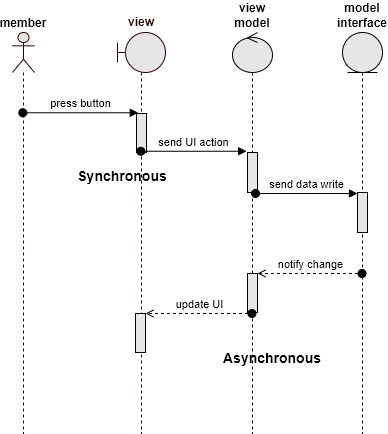

# ADR-IM-002 Adopt UI design pattern MVVM
status: Approved  
date: 2022-11-04  
deciders: Shari

## Context and Problem Statement
The interaction management system requires a user interface (UI), a location and map model and a controller to update the location and facilitate connections.

## Decision Drivers
The interaction management system design comprises of a UI, UI controller, location manager/ map server, which is a view (the UI), a model (location and map) and a controller (business logic sat between the two)

There are several established options for the design and how these components work together.  The options include the model view controller (MVC), the model view presenter (MVP) and the model view viewmodel (MVVM).

Following the Event-Driven Serverless and Extendible ADRs, the selected pattern is the MVVM which utilizes event notification and model view binding.

Pros of using this pattern
- [x] Design is decoupled, can easily replace any component
- [x] Multiple views and UIs are supported
- [x] Events triggered on change ensure UI is always up to date

Cons of using this pattern
- [ ] More complicated to code and support, requires event management
- [ ] More complex to test, not a simple call, requires events to be triggered

## Decision
The interaction manager will follow the MVVM, Model-View-ViewModel design pattern

## Consequences
An event notification and management system will need to be built and maintained.
Testing and regression will need to incorporate asynchronous changes, which is more complex than a straight forward method call.
