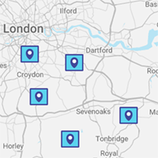

# ADR-IM-004 Provide radar for local area
status: Approved  
date: 2022-11-08  
deciders: Shari

## Context and Problem Statement

## Decision Drivers
There are a number of options for the map display as described below:

 * Show either citizens or officers 
 * Show either a map or a proximity radar

                                                                                                                                                    

## Decision
The recommendation is to locate the citizens for the reason that any tracking of police officers is inadvisable.
The decision is to use a radar image over a precise map:

## Consequences
A consequence of the decision is a change to requirements to track citizens over police officers.

Should the officer tracking be required the recommendation is to isolate the role of a community officer additionally to or over enforcement.

