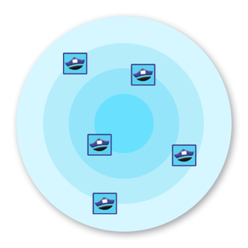
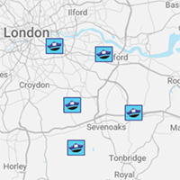

# ADR-IM-004 Provide radar for local area
status: draft  
date: 2022-11-08  
deciders: Shari

## Context and Problem Statement
The interaction management system requires a member of the community and an officer to interact.

As such the profile manager will need to identify the users as a member or an officer.  However the privacy and identification of individuals must be protected.

## Decision Drivers
There are a number of options for the map display as described below:

<table class="adr">
  <tr>
    <td></td>
	<td></td>
	<td></td>
  </tr>
</table>​​​

## Decision
The recommendation is to locate the citizens for the reason that any tracking of police officers is inadvisable.
The decision is to use a radar image over a precise map:

## Consequences
A consequence of the decision is a change to requirements to track citizens over police officers

