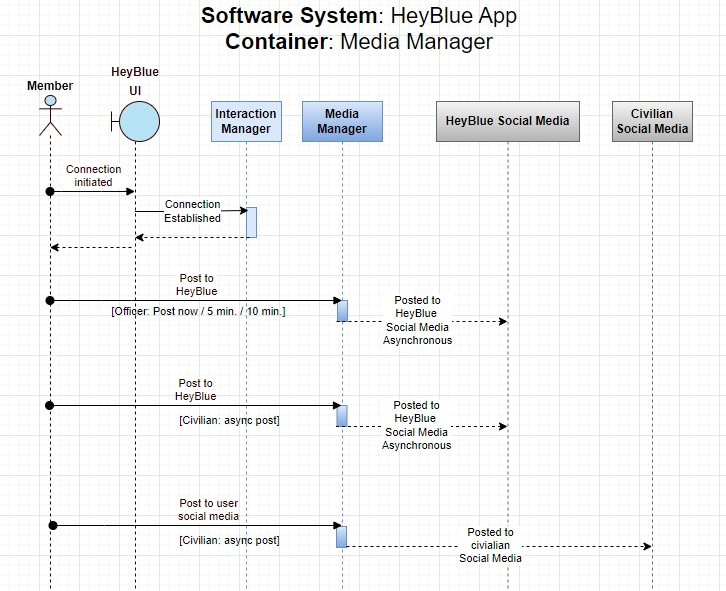
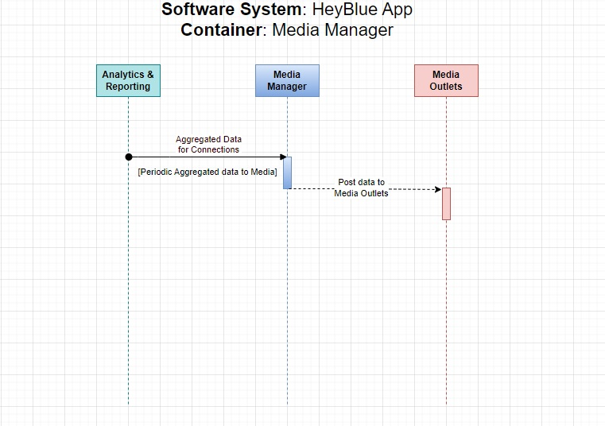

# Media Management

# Architectural Structure

## System Context
The *Media Manager* is responsible for:
 * Receiving and publishing the request from Officer to publish to HeyBlueApp Social Media
 * Receiving and publishing the request from Civilian to publish to their/his/her (user) Social Media
 * Receiving request from Analytics and Reporting to provide aggregate interaction data to local media.
 

## System Containers - Draft

